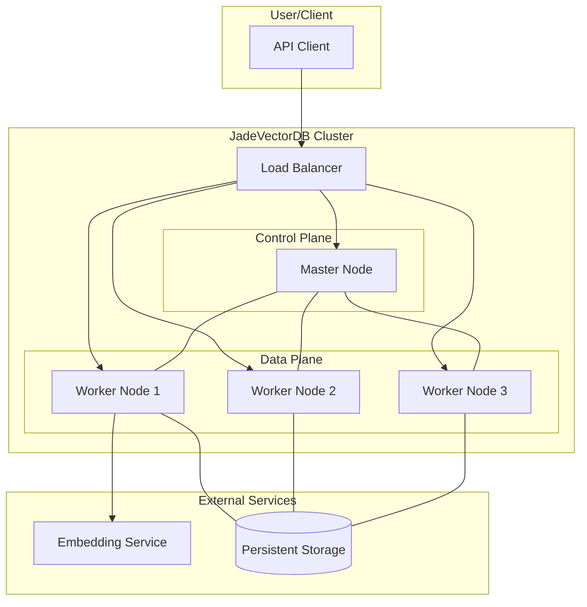
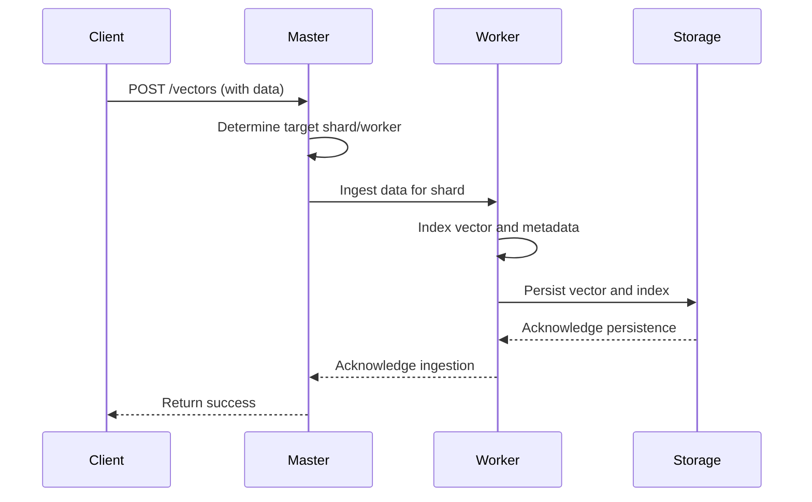
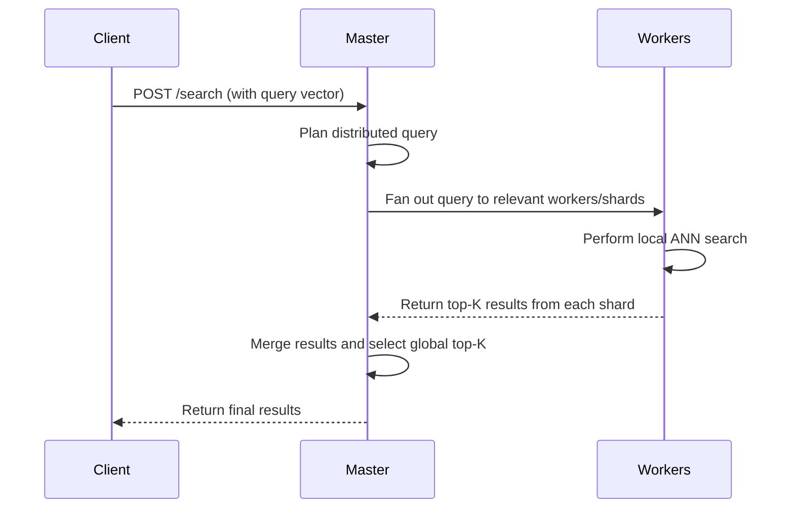

# JadeVectorDB Architecture Document

**Status:** Draft
**Version:** 0.1

**Note:** This document provides a detailed overview of the system architecture for JadeVectorDB. It is a living document and should be updated as design decisions are made and the system evolves. This document and the main `spec.md` are tightly linked; changes in one should be reflected in the other.

## 1. Architectural Goals and Constraints

The architecture is designed to meet the following key goals:
- **High Performance:** Achieve low-latency search and high-throughput ingestion.
- **Scalability:** Horizontally scale to handle billions of vectors and high concurrent loads.
- **Resilience:** Ensure high availability and fault tolerance with no single point of failure.
- **Maintainability:** Promote a clean separation of concerns to allow for independent development and deployment of components.

The key constraints are detailed in the `spec.md` document under the "Technical Constraints" section.

## 2. System Architecture Overview

JadeVectorDB will be implemented as a distributed, microservices-based system. The architecture follows a master-worker pattern for coordination and data distribution.

### High-Level Diagram

This diagram illustrates the main components of the system and their interactions.

*Diagram: High-level overview of JadeVectorDB components.*

### Component Descriptions

- **API Client:** Any application that interacts with the database via the REST or gRPC API.
- **Load Balancer:** Distributes incoming API requests across the appropriate nodes in the cluster.
- **Master Node:** The brain of the cluster. It does not store any vector data itself. Its responsibilities include:
    - Managing cluster state (e.g., list of active workers).
    - Handling database and index metadata.
    - Coordinating distributed operations like data sharding and query planning.
    - Performing leader election for high availability.
- **Worker Nodes:** The workhorses of the cluster. Responsibilities include:
    - Storing and managing a subset (shard) of the vector data.
    - Performing local similarity searches on its shard.
    - Handling data ingestion, indexing, and retrieval for its shard.
- **Persistent Storage:** A durable storage layer (e.g., a distributed file system or cloud object storage) where vectors and indexes are persisted.
- **Embedding Service:** An optional external or internal service for generating vector embeddings from raw data.

## 3. Data Flow

### Data Ingestion Flow

*Diagram: Sequence of events during data ingestion.*

### Search Query Flow

*Diagram: Sequence of events during a distributed search query.*

## 4. Future Considerations

This section will be expanded to include:
- Detailed C4 models (Context, Containers, Components, Code).
- Network architecture and security group considerations.
- Data replication and consistency models in more detail.
- Deployment architecture for Kubernetes and major cloud providers.
