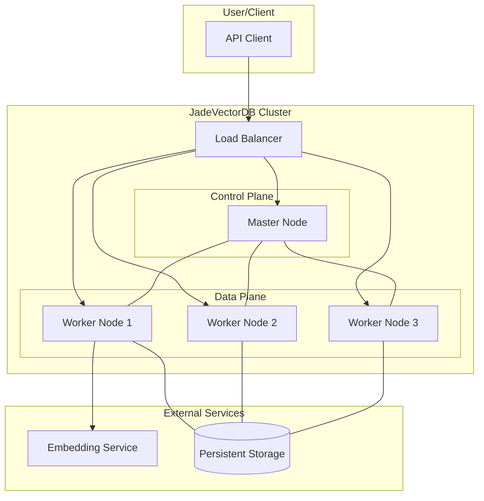
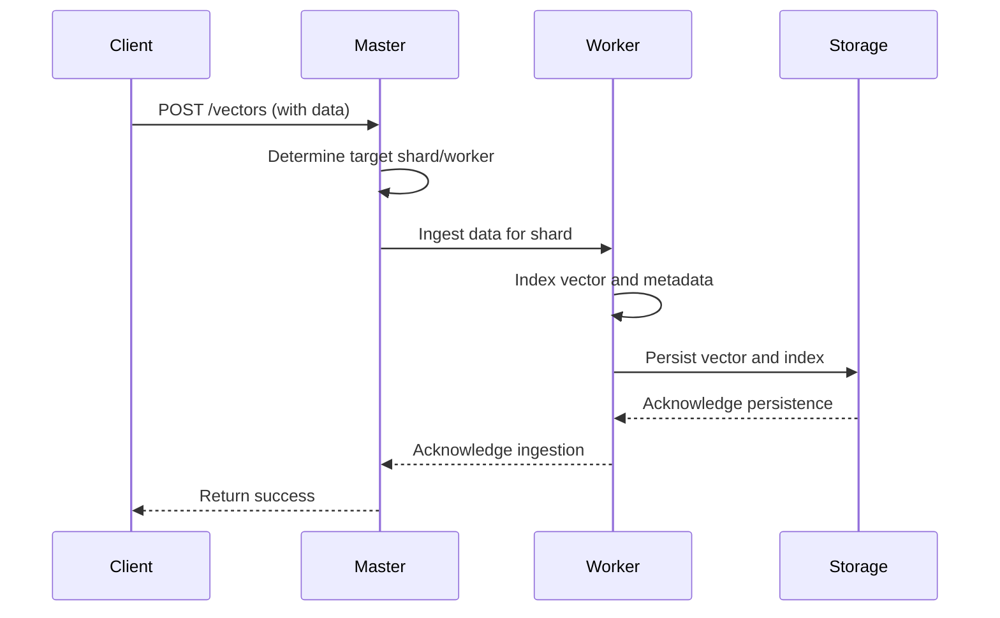
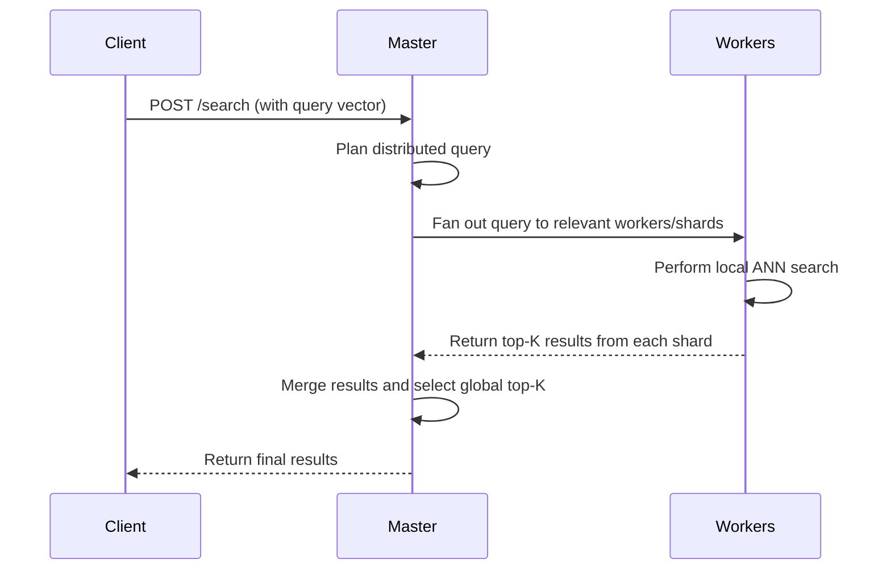
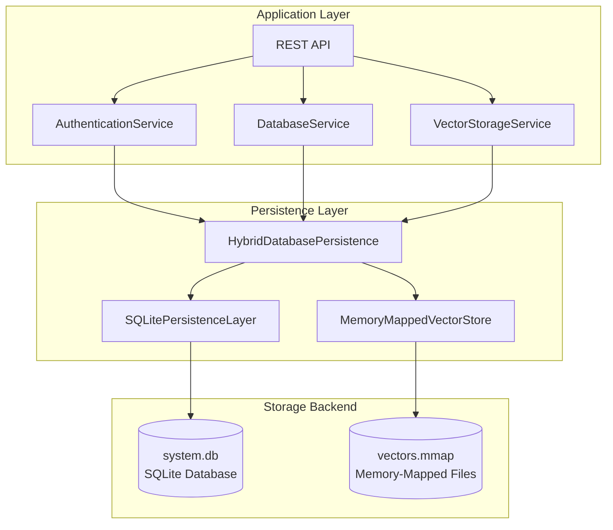
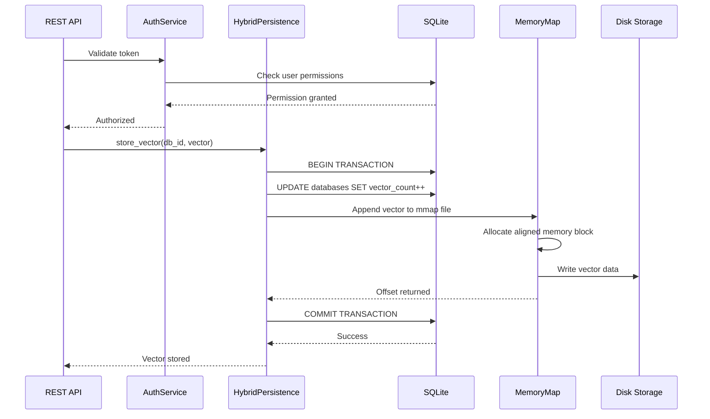

# JadeVectorDB Architecture Document

**Status:** Draft
**Version:** 0.1

**Note:** This document provides a detailed overview of the system architecture for JadeVectorDB. It is a living document and should be updated as design decisions are made and the system evolves. This document and the main `spec.md` are tightly linked; changes in one should be reflected in the other.

## 1. Architectural Goals and Constraints

The architecture is designed to meet the following key goals:
- **High Performance:** Achieve low-latency search and high-throughput ingestion.
- **Scalability:** Horizontally scale to handle billions of vectors and high concurrent loads.
- **Resilience:** Ensure high availability and fault tolerance with no single point of failure.
- **Maintainability:** Promote a clean separation of concerns to allow for independent development and deployment of components.

The key constraints are detailed in the `spec.md` document under the "Technical Constraints" section.

## 2. System Architecture Overview

JadeVectorDB will be implemented as a distributed, microservices-based system. The architecture follows a master-worker pattern for coordination and data distribution.

### High-Level Diagram

This diagram illustrates the main components of the system and their interactions.


*Diagram: High-level overview of JadeVectorDB components.*

### Component Descriptions

- **API Client:** Any application that interacts with the database via the REST or gRPC API.
- **Load Balancer:** Distributes incoming API requests across the appropriate nodes in the cluster.
- **Master Node:** The brain of the cluster. It does not store any vector data itself. Its responsibilities include:
    - Managing cluster state (e.g., list of active workers).
    - Handling database and index metadata.
    - Coordinating distributed operations like data sharding and query planning.
    - Performing leader election for high availability.
- **Worker Nodes:** The workhorses of the cluster. Responsibilities include:
    - Storing and managing a subset (shard) of the vector data.
    - Performing local similarity searches on its shard.
    - Handling data ingestion, indexing, and retrieval for its shard.
- **Persistent Storage:** A durable storage layer (e.g., a distributed file system or cloud object storage) where vectors and indexes are persisted.
- **Embedding Service:** An optional external or internal service for generating vector embeddings from raw data.

## 3. Data Flow

### Data Ingestion Flow


*Diagram: Sequence of events during data ingestion.*

### Search Query Flow


*Diagram: Sequence of events during a distributed search query.*

## 4. Persistent Storage Architecture

### 4.1 Hybrid Storage Design

JadeVectorDB implements a two-tier storage architecture optimized for different data characteristics:



### 4.2 SQLite Storage (Metadata)

**Location**: `/var/lib/jadevectordb/system.db`

**Purpose**: ACID-compliant storage for all transactional metadata

**Tables**:
- **Users**: User accounts with bcrypt password hashing
- **Groups**: User groups with ownership tracking
- **Roles**: Predefined and custom roles
- **Permissions**: Granular permission definitions
- **User_Roles**: Role assignments to users
- **Role_Permissions**: Permission grants to roles
- **Database_Permissions**: Per-database access control
- **API_Keys**: Long-lived authentication keys
- **Auth_Tokens**: Short-lived session tokens
- **Sessions**: Active user sessions
- **Databases**: Database metadata and configuration
- **Indexes**: Index metadata and build status
- **Audit_Log**: Security and access audit trail

**Configuration**:
- **Journal Mode**: WAL (Write-Ahead Logging) for concurrency
- **Synchronous**: NORMAL (balanced durability/performance)
- **Cache Size**: 10,000 pages (~40MB)
- **Temp Store**: MEMORY for performance

### 4.3 Memory-Mapped Vector Storage

**Location**: `/var/lib/jadevectordb/databases/{database_id}/vectors.mmap`

**Purpose**: High-performance vector data storage with zero-copy access

**File Format**:
```
[Header: 256 bytes]
  - Magic: "JADE" (4 bytes)
  - Version: uint32 (4 bytes)
  - Dimension: uint32 (4 bytes)
  - Vector Count: uint64 (8 bytes)
  - Free List Offset: uint64 (8 bytes)
  - Index Offset: uint64 (8 bytes)
  - Reserved: (224 bytes)

[Vector Index: Variable]
  - Map of vector_id (string) -> file_offset (uint64)
  - Serialized as length-prefixed strings + offsets

[Vector Data: Variable]
  - SIMD-aligned vector blocks (32-byte alignment)
  - Each block: [vector_id_len, vector_id, dimension, float32[]]
  - Deleted vectors tracked in free list
```

**Access Pattern**:
1. File mapped to process virtual memory via mmap()/MapViewOfFile()
2. Operating system handles page caching and swapping
3. SIMD operations access aligned memory directly
4. Periodic msync()/FlushViewOfFile() for durability

**Advantages**:
- Zero-copy access to vector data
- OS-managed caching (leverages available RAM)
- SIMD vectorization compatibility
- Efficient for large datasets (GBs to TBs)
- Supports concurrent reads naturally

### 4.4 Data Flow: Write Operation



### 4.5 Persistence Layer Classes

**Key Classes**:
- `SQLitePersistenceLayer`: Manages all SQLite operations
- `HybridDatabasePersistence`: Orchestrates SQLite + mmap
- `MemoryMappedVectorStore`: Manages per-database vector files
- `AuthenticationService`: Enhanced with persistence backing

**Interface**:
```cpp
class DatabasePersistenceInterface {
    // Database operations
    virtual Result<std::string> create_database(const Database& db) = 0;
    virtual Result<Database> get_database(const std::string& id) = 0;
    
    // Vector operations
    virtual Result<void> store_vector(const std::string& db_id, 
                                     const Vector& vector) = 0;
    virtual Result<Vector> retrieve_vector(const std::string& db_id,
                                          const std::string& vector_id) = 0;
    // ...
};
```

### 4.6 Durability Guarantees

**SQLite (Metadata)**:
- WAL mode ensures atomic commits
- Checkpoints every 1000 transactions or 5 minutes
- Survives ungraceful shutdown (crash recovery)

**Memory-Mapped Files (Vectors)**:
- Periodic sync every 5 seconds (configurable)
- Sync on graceful shutdown
- May lose last few seconds of writes on power loss
- Trade-off: Balanced durability vs. write performance

**Configuration Options**:
```ini
# config/jadevectordb.conf
[storage]
data_directory=/var/lib/jadevectordb
sqlite_wal_checkpoint_interval=1000
vector_sync_interval_sec=5
vector_sync_on_write=false  # true for immediate durability
```

## 5. Future Considerations

This section will be expanded to include:
- Detailed C4 models (Context, Containers, Components, Code).
- Network architecture and security group considerations.
- Data replication and consistency models in more detail.
- Deployment architecture for Kubernetes and major cloud providers.
